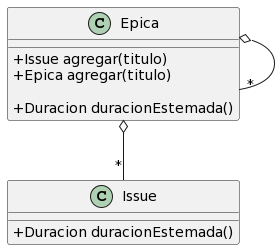

## Primer ejercicio de modelado

1 - (Peso %70) Ejercicio de modelado (se recomienda leer todo el ejercicio antes de comenzar). Se desea modelar parte de
un sistema mediante el paradigma de objetos. Necesitamos construir una parte del modelo de la plataforma de venta de
entradas que nos permita generar los tickets de ingresos para Taylor Swift. Las entradas disponibles:

- Tipo A:
    - Precio $ 600
- Tipo B:
    - Precio: $ 5000
- Existen distintos tipos de medios de pagos que te las permiten adquirir, a saber:
    - Tarjeta PertenenciaH, puede comprar cualquier tipo de entrada. No tiene límite de compra.
    - Tarjeta Gold, puede comprar entradas de Tipo A. Tiene por límite de compra $1000.
- Casos de uso:
    1. Un comprador pide 2 entradas TipoB y paga con la tarjeta debería recibir dos entradas.
    2. Un comprador pide 2 entradas TipoA y paga con la tarjeta Gold debería recibir una sola entrada.
    3. Un comprador pide 2 entradas TipoB, 2 entradas TipoA con la tarjeta PertenenciaH debería recibir las 4 entradas.
- Se pide:
    - Diagrama de clases completo incluyendo todas las clases y abstracción por más que no se utilicen en los diagramas
      de secuencia de los casos de uso.
    - Diagrama de secuencia para cada uno de los casos de uso.
    - Código de la prueba (no de la implementación que hace pasar la prueba) para cada uno de los casos de uso

#### IMPORTANTE

En cada diagrama de secuencia mostrar la inicialización de los objetos involucrados

## segundo ejercicio

2 - (Peso %30) - Ejercicio conceptual (se recomienda leer todo el ejercicio antes de comenzar). El siguiente diagrama
describe una porción de una herramienta de gestión de proyectos. Adicionalmente existe la promoción de un issue:
significa convertir un issue a épica manteniendo el contenedor del issue.

1. ¿Qué significa cada una de las relaciones?
2. ¿Como actualizar y/o modificar el diagrama de clases para agregar la promoción de issues?
3. ¿Cómo quedaría el diagrama de secuencia de una promoción de un issue?

# Primer ejercicio

## Analizando el problema

### Entidades

- plataforma -> se encarga de la compra de entradas
- entrada
    - entradaA
    - entradaB
- tarjeta
    - gold
    - pertenenciaH

### Diseño por contrato (estas dos prueba van a estar como casos de uso)

Creo que no se pide lanzar excepcion si se trata de comprar entrada B con tarjeta gold

### Extras

Se va a usar el patron de diseño visitor (double dispatch en diferentes jerarquias)

### Algunas decisiones de diseño

No se que es mejor, si cada vez que se agrega una tarjeta se tenga que agregar un metodo en cada entrada o viceversa

### Diagrama de clases

### Diagrama de secuencia