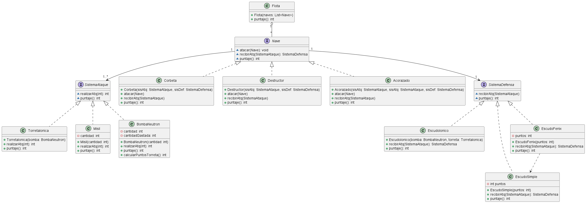
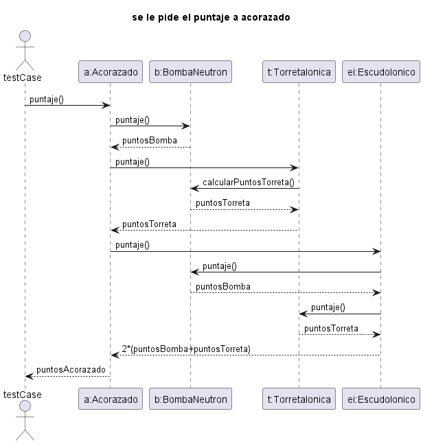
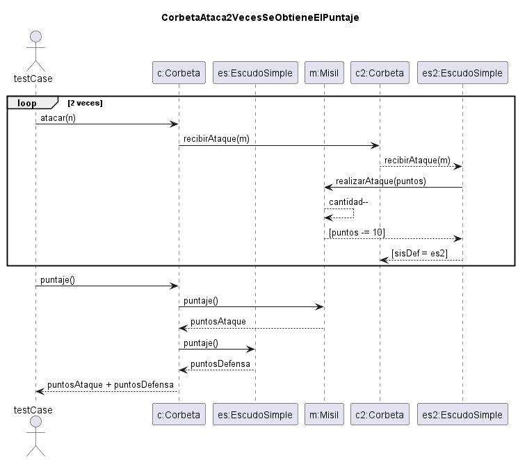
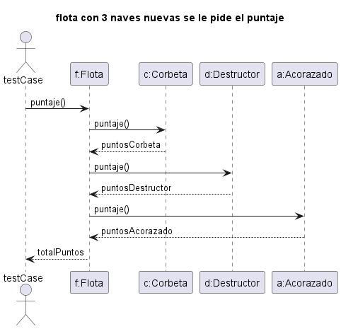

## Ejercicio de modelado

En un imperio intergaláctico existen distintos tipos de naves espaciales. El puntaje total de cada nave dependerá de con
que tipo de sistema de ataque y defensa esté equipada la misma, el estado actual de ambos y será la suma de ambos
sistemas.

#### Características de una Corbeta:

- Posee 3 misiles que suman 10 puntos cada uno. A medida que dispara se le van gastando. Si se queda sin misiles suma 0
  puntos en ataque.
- Posee un escudo simple, suma 20 puntos. A medida que recibe daños se le va restando los puntos. Por ejemplo: si una
  corbeta nueva recibe un ataque de 1 misil, luego del ataque su escudo sumará 10 puntos.

#### Características de un Destructor:

- Posee 5 misiles. Cuando el destructor tiene los 5 misiles suma 10 puntos por cada uno + 20 puntos extras. Con 4
  misiles o menos, solo suma una unidad por cada misil. Si se queda sin misiles suma 0 puntos en ataque
- Posee un escudo Fenix que suma 50 puntos, pero al ser destruido, el mismo revive en forma de escudo simple sumando 30
  puntos.

#### Características de un Acorazado:

- Posee un doble sistema de ataque:
  - 10 bombas de neutrones. Suman 5 puntos cada una. A medida que dispara se le van gastando hasta quedarse sin bombas y
    sumar 0.
  - Torreta iónica: Suma 100 puntos al contar con las 10 bombas de neutrones, caso contrario resta 10 puntos por cada
    bomba de neutrones gastada.
- Posee un escudo iónico, que multiplica x 2 el puntaje de ataque que tenga la nave que lo contiene.

#### Características de una Flota:

- Posee un número ilimitado de naves mayor a cero.

<b>NOTA 1</b>: El puntaje total puede ser positivo, cero o negativo dadas las circunstancias en algún momento para una
nave.

<b>NOTA 2</b>: En cada disparo se consume 1 misil / bomba de neutrones a la vez.

<b>NOTA 3</b>: Al recibir ataques las naves van restando su puntaje de escudo. (Salvo el escudo iónico que no se ve
afectado por ataques, siempre multiplica x 2 su puntaje de ataque)

<b>NOTA 4</b>: Los puntajes no son estáticos, son dinámicos. Por ejemplo el puntaje de ataque va cambiando a medida que
se gastan disparos. Lo mismo pasa para el puntaje de defensa, puede ir cambiando a medida que se reciben ataques.

Los casos de uso son:

1. Calcular el puntaje total de una Corbeta nueva luego de que dispara 2 misiles.
2. Calcular el puntaje total de un Destructor nuevo que cuenta con 5 misiles y recibe 6 ataques de misiles. (El ataque
   puede provenir de otro/s destructor/es y/o corbeta/s)
3. Calcular el puntaje total de un flota con una Corbeta, un Destructor y un Acorazado nuevos.

Se pide:

1. Diagrama de clases (completo) que representen el modelo descrito.
2. Diagrama de secuencia para cada uno de los casos de uso.
3. Código de la prueba para cada uno de los casos de uso.

#### IMPORTANTE

En cada diagrama de secuencia mostrar la inicialización de los objetos involucrados

# Primer ejercicio

## Analizando el problema

Hay muchas clases y varias cosas dando vuelta

### Entidades

- Sistema de ataque
  - Misil
  - Bomba
  - Torreta Ionica
- Sistema de defensa
  - EscudoSimple
  - EscudoFenix
  - EscudoIonico
- Nave
  - Corbeta
  - Destructor
  - Acorazado
- Flota
- Ademas el escudo fenix cuenta con un estado
  - EstadoEscudo
  - EstadoEscudoSimple
  - EstadoEscudoFenix edit: elimine los estados de escudo, cada vez que se recibe un ataque se devuelve un sistema de
    defensa.
### Diseño por contrato (estas dos prueba van a estar como casos de uso)

### Extras

### Algunas decisiones de diseño

### Diagrama de clases

### Diagrama de secuencia

