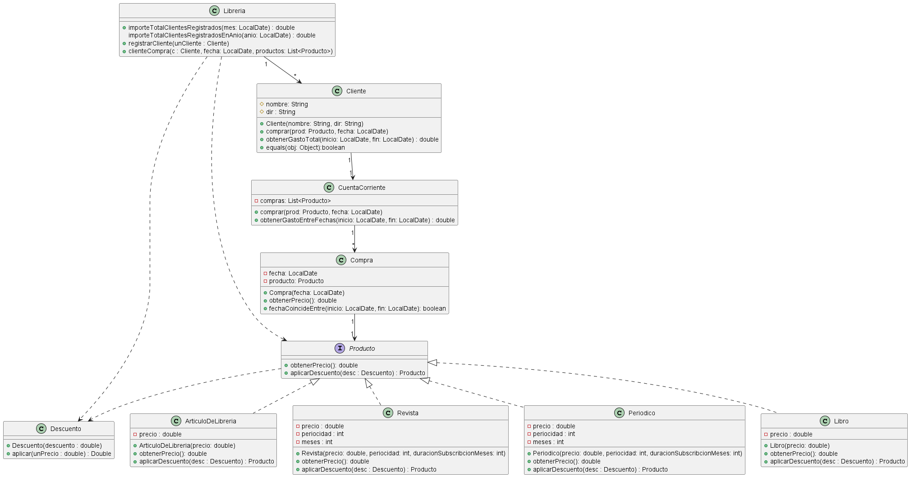
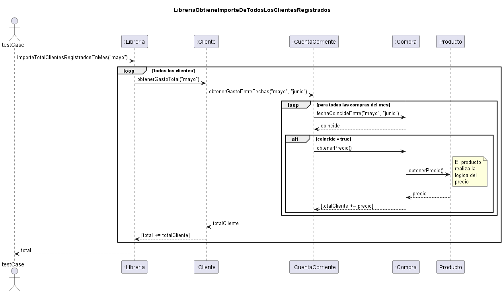

# Libreria

Una librería vende productos que se dividen en las siguientes categorías: libros, artículos de librería, revistas y
periódicos. Las revistas y periódicos tienen una periodicidad que mediremos en cantidad de veces al mes que se publican.
Todos los productos tienen un precio asociado. Los artículos de librería tienen además del precio de venta, llevan IVA
en la venta. Además el kiosco tiene clientes, de los cuales almacena los datos esenciales incluyendo la dirección, y que
productos han comprado en un determinado mes y que suscripciones (a revistas o periódicos) ha adquirido el cliente, los
productos que compran los clientes se anotan en su cuenta corriente y se les cobra a fin de mes. El kiosco necesita como
funcionalidad saber para un determinado mes cuánto debe cobrarle a cada cliente, y lo mismo para un año entero. Para los
clientes registrados en el sistema hay un 5% de descuento sobre todas sus compras y además quienes realizan una
suscripción anual existe un 20% de descuento sobre el precio del producto (revista o periódico) al cual se suscriben (
este descuento es sobre el precio del producto y no se acumula a otros descuentos).

- Realizar el diagrama de clases correspondiente, detallando los métodos y atributos más importantes.
- Realizar un diagrama de secuencia sobre la obtención de la suma de los importes a cobrarles a los clientes
  registrados, para un mes determinado.

## Analizando el problema por primera vez

### Entidades

- Libreria
- Cliente
- Productos (Libros, ArticulosDeLibreria, Revistas, Periodicos)
- Cuenta Corriente (donde aparecen lo que uno compra, subscripciones y esto ordenado por mes)
- Compra (lo que un cliente compra o subscribe)
- Descuento

### Diseño por contrato (estas dos prueba van a estar como casos de uso)

- El kiosco necesita como funcionalidad saber para un determinado mes cuánto debe cobrarle a cada cliente
- idem pero un año

### Extras

- ArticulosDeLibreria tiene iva 21%
- revistas y periodicos tiene 20% descuento si se subscribe 12 meses y no aplica otro descuento
- los clientes registrados tienen 5% descuento -> se debe poder registrar un cliente
- se pide el gasto de cada cliente a traves de su cuenta corriente (no hay registro de ventas en la libreria)

### Algunas decisiones de diseño

- el cliente no tiene estado registrado o no debido a que la libreria sabe eso
  - esto nos lleva a tener un mecanismo de alta / baja
- el ejercicio solo pide conseguir el importe de los clientes, es decir ya se compraron los productos -no haria falta
  modelar los descuentos ya que eso se puede tomar en cuenta al comprarlos
- la revista y el periodico son productos, se crean con una duracion en meses
  - es decir te podes subscribir por x meses pagandolos de antemano a fin de mes
  - el ejercicio no aclara el modo de compra de las subscripciones, ni para que sirve la periocidad
  - las subscripciones por menos de 12 meses pueden tener descuento de cliente registrado.
- Excepciones
  - No agregue excepciones, pero deberia haber bastantes en la creacion de los productos

### Diagrama de clases

### Diagrama de secuencia

